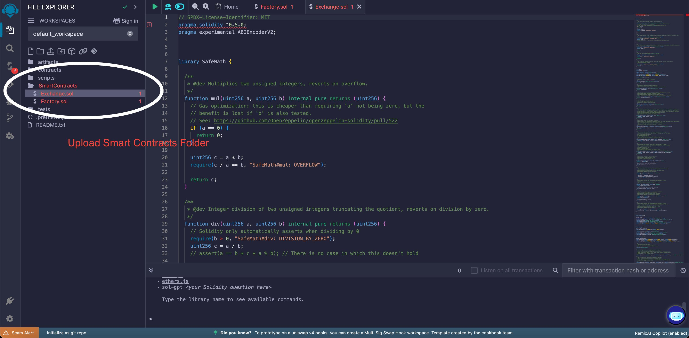
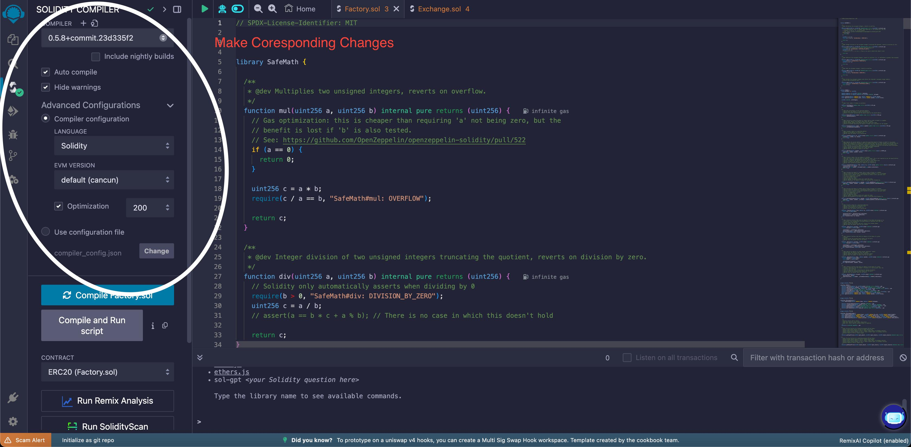
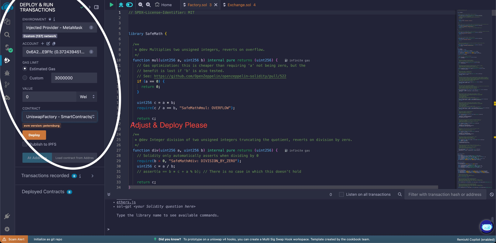

# Uniswap DEX Implementation

A fully functional decentralized exchange (DEX) built on Ethereum, implementing Uniswap V1 protocol with modern UI/UX. This implementation includes automated market maker (AMM) functionality, liquidity pools, and token swapping capabilities.

## Features

- Token Swapping (ETH ERC20, ERC20 ERC20)
- Liquidity Pool Management
- Real-time Price Charts
- Web3 Wallet Integration
- Secure Smart Contracts
- Automated Market Maker
- Multi-language Support
- Responsive Design

## Prerequisites

- Node.js (v14.0.0 or later)
- npm or yarn
- MetaMask or any Web3 wallet
- Git

## Installation

1. Clone the repository:
```bash
git clone https://github.com/sovanza-inc/UniswapDex
cd UniswapDex
```

2. Install dependencies:
```bash
yarn install
# or
npm install
```

3. Create a `.env` file in the root directory with the following variables:
```env
REACT_APP_INFURA_KEY=your_infura_key
REACT_APP_NETWORK_URL=""
REACT_APP_CHAIN_ID="1"
```

4. Start the development server:
```bash
yarn start
# or
npm start
```

## Smart Contract Deployment Guide

Follow these steps to deploy the smart contracts and obtain the necessary addresses:

1. **Access Remix IDE**
   - Go to [Remix IDE](https://remix.ethereum.org/)
   - Create a new workspace

2. **Import Smart Contracts**
   - Upload `Factory.sol` and `Exchange.sol` from the `SmartContracts` folder to Remix
   - Both contracts should appear in your workspace
   
   

3. **Configure Solidity Compiler**
   - Select Solidity Compiler (0.5.0)
   - Set EVM Version to "default (cancun)"
   - Enable optimization with 200 runs
   - Compile `Factory.sol`
   
   

4. **Deploy Factory Contract**
   - Go to the Deploy tab
   - Connect MetaMask to your network
   - Set appropriate gas limit (e.g., 3000000)
   - Deploy `Factory.sol`
   - Save the deployed Factory contract address
   
   

5. **Create Exchange Pairs**
   - After deploying Factory, you'll use it to create exchange pairs for your tokens
   - For each token:
     1. Call `createExchange(tokenAddress)` function on Factory contract
     2. This will create a new Exchange contract for your token
     3. Use `getExchange(tokenAddress)` to get the EXCHANGE_ADDRESS
     4. Save this EXCHANGE_ADDRESS for your token configuration

6. **Update Contract Addresses**
   
   a) Update `.env` file with your network URL and chain ID:
   ```env
   REACT_APP_NETWORK_URL="YOUR_NETWORK_RPC_URL"
   REACT_APP_CHAIN_ID="YOUR_CHAIN_ID"
   ```

   b) Update token configuration in `src/contexts/Tokens.js`:
   ```javascript
   YOUR_CHAIN_ID: {
     'YOUR_TOKEN_ADDRESS_1': {
       [NAME]: 'Your First Token',
       [SYMBOL]: 'TK1',
       [DECIMALS]: 18,
       [EXCHANGE_ADDRESS]: 'EXCHANGE_ADDRESS_1'
     },
     'YOUR_TOKEN_ADDRESS_2': {
       [NAME]: 'Your Second Token',
       [SYMBOL]: 'TK2',
       [DECIMALS]: 18,
       [EXCHANGE_ADDRESS]: 'EXCHANGE_ADDRESS_2'
     }
     // Add more tokens as needed...
   }
   ```

   This configuration allows you to list multiple tokens for a particular chain ID. Each token entry requires:
   - A unique contract address as the key
   - Token details including name, symbol, decimals, and its corresponding exchange address
   - You can add as many tokens as needed following the same structure

   Replace:
   - `YOUR_CHAIN_ID`: Your blockchain network ID (e.g., 7007)
   - `YOUR_TOKEN_ADDRESS_1`, `YOUR_TOKEN_ADDRESS_2`: Your tokens' contract addresses
   - `EXCHANGE_ADDRESS_1`, `EXCHANGE_ADDRESS_2`: Exchange addresses obtained from Factory contract

7. **Verify Contracts (Optional but Recommended)**
   - On your blockchain explorer (e.g., BSCScan)
   - Verify both Factory and Exchange contracts
   - This allows users to interact with your contracts through the explorer

Important Notes:
- Make sure you have enough native tokens (e.g., BNB, ETH) for deployment
- Double-check all addresses before deploying
- Keep your Factory address safe as it's needed for future exchange pair creation
- Test with small amounts first on testnet before mainnet deployment
- Always verify contract addresses match between your frontend and blockchain

For detailed contract interaction:
1. Factory Contract Functions:
   - `createExchange(tokenAddress)`: Creates new exchange pair
   - `getExchange(tokenAddress)`: Gets exchange address for a token
   - `getToken(exchangeAddress)`: Gets token address for an exchange
   - `getTokenWithId(tokenId)`: Gets token address by ID

2. Exchange Contract Functions:
   - `addLiquidity(min_liquidity, max_tokens, deadline)`: Add liquidity to pool
   - `removeLiquidity(amount, min_eth, min_tokens, deadline)`: Remove liquidity
   - `getInputPrice(input_amount, input_reserve, output_reserve)`: Calculate input price
   - `getOutputPrice(output_amount, input_reserve, output_reserve)`: Calculate output price

Remember to always test your deployment on a testnet first before proceeding to mainnet.

## Project Structure

```
UniswapDex/
├── src/
│   ├── assets/         # Static assets
│   ├── components/     # Reusable UI components
│   ├── connectors/     # Blockchain connectors
│   ├── contexts/       # React contexts
│   ├── hooks/          # Custom React hooks
│   ├── pages/          # Main application views
│   └── utils/          # Helper functions
├── SmartContracts/
│   ├── Exchange.sol    # DEX exchange contract
│   └── Factory.sol     # Pair factory contract
└── public/             # Public assets
```

## Usage

1. **Connect Wallet**
   - Click "Connect Wallet" button
   - Select your Web3 wallet (MetaMask recommended)
   - Approve the connection

2. **Token Swapping**
   - Select input and output tokens
   - Enter amount to swap
   - Click "Swap" and confirm transaction

3. **Adding Liquidity**
   - Navigate to "Pool" section
   - Select token pair
   - Enter amounts
   - Click "Add Liquidity"

## Security Features

- SafeMath implementation for arithmetic operations
- Input validation and checks
- Deadline parameters for transactions
- Slippage protection
- Access control mechanisms

## Testing

Run the test suite:

```bash
# Smart Contract Tests
truffle test

# Frontend Tests
yarn test
# or
npm test
```

## Production Deployment

Follow these steps to deploy your DEX to production:

1. **Create Production Build**
   ```bash
   # Using yarn
   yarn build
   # OR using npm
   npm run build
   ```
   This will create a `build` folder containing optimized production files.

2. **Hosting Options**

   a) **Traditional Hosting**
   - Upload the contents of the `build` folder to your web hosting server
   - Configure your server to handle React router (redirect all requests to index.html)
   
   b) **Netlify**
   - Create a new site from Git in Netlify
   - Set build command: `yarn build`
   - Set publish directory: `build`
   - Deploy!
   
   c) **Vercel**
   - Install Vercel CLI: `npm i -g vercel`
   - Run `vercel` in project directory
   - Follow the prompts
   
   d) **GitHub Pages**
   - Update `homepage` in package.json
   - Deploy using `yarn deploy`

3. **Environment Setup**
   - Create `.env.production` file
   - Configure production environment variables:
   ```env
   REACT_APP_NETWORK_URL=your_production_rpc_url
   REACT_APP_CHAIN_ID=your_chain_id
   ```

4. **Post-Deployment Checks**
   - Verify wallet connections
   - Test token swaps
   - Confirm liquidity operations
   - Check token listings
   - Verify transaction confirmations

Important Notes:
- Always test the production build locally first: `serve -s build`
- Ensure your RPC endpoints are production-ready and reliable
- Configure proper CORS settings if using custom RPC nodes
- Set up proper monitoring and analytics
- Consider using a CDN for better performance

## Contributing

1. Fork the repository
2. Create your feature branch (`git checkout -b feature/AmazingFeature`)
3. Commit your changes (`git commit -m 'Add some AmazingFeature'`)
4. Push to the branch (`git push origin feature/AmazingFeature`)
5. Open a Pull Request

## White-Labeling Instructions

This DEX can be easily white-labeled to create your own branded decentralized exchange. Follow these steps to customize:

1. **Change Application Title**
   - Navigate to `public/index.html`
   - Update the `<title>` tag with your brand name
   ```html
   <title>Your Brand DEX</title>
   ```

2. **Update Logo in Header**
   - Go to `components/header/index.js`
   - Replace the logo image source
   ```javascript
   
   ```

3. **Update Token Logo**
   - In `components/tokenLogo/index.js`
   - Change the default token logo
   ```javascript
   return <Image src="/your-logo.png" size={size} alt="Your Logo" {...rest} />
   ```

4. **Customize Wallet Connection**
   - Navigate to `src/connectors`
   - Update WalletLink connector configuration
   ```javascript
   export const walletlink = new WalletLinkConnector({
     url: NETWORK_URL,
     appName: 'Your Brand DEX',
     appLogoUrl: '/your-logo.png'
   })
   ```

5. **Configure Token List**
   - In `src/contexts/Tokens.js`
   - Add your tokens under your chain ID (e.g., 7007)
   ```javascript
   7007: {
     'YOUR_TOKEN_ADDRESS': {
       [NAME]: 'Token Name',
       [SYMBOL]: 'TKN',
       [DECIMALS]: 18,
       [EXCHANGE_ADDRESS]: 'TOKEN_EXCHANGE_ADDRESS'
     },
     // Add more tokens...
   }
   ```
   
   Example token entry:
   ```javascript
   '0x1234...': {
     [NAME]: 'My Token (MTK)',
     [SYMBOL]: 'MTK',
     [DECIMALS]: 18,
     [EXCHANGE_ADDRESS]: '0xabcd...'
   }
   ```

6. **Update Liquidity Pages**
   - In `src/pages/Pool/AddLiquidity.js`
   - In `src/pages/Pool/RemoveLiquidity.js`
   - Search for 'BSTC' and replace with your token symbol
   - This ensures your token name appears correctly in liquidity-related operations
   ```javascript
   // Example: Replace text like
   'BSTC' -> 'YOUR_TOKEN'
   ```

Make sure to replace all placeholder values (Your Brand, your-logo.png, YOUR_TOKEN, etc.) with your actual branding assets and information. Each token entry in the token list should include the token's contract address as the key, and the NAME, SYMBOL, DECIMALS, and EXCHANGE_ADDRESS properties.

## License

This project is licensed under the MIT License - see the [LICENSE](LICENSE) file for details.

## Support

For support, please open an issue in the GitHub repository or contact admin@sovanzacom.

## Disclaimer

This software is provided "as is", without warranty of any kind. Use at your own risk.

---

 If you found this project helpful, please consider giving it a star!
